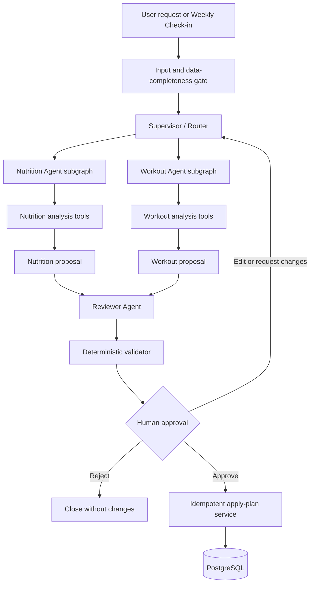
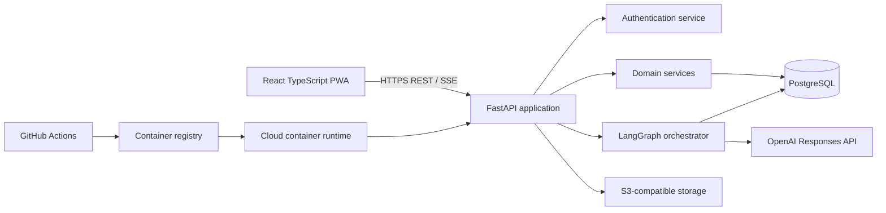

# MacroRep Project Plan

**Working title:** MacroRep  
**Full title:** *MacroRep: A Multi-Agent Nutrition and Strength Training Companion*  
**Tagline:** *Track your meals. Log your lifts. Adapt your plan.*  
**Team size:** 4  
**Document status:** Initial implementation plan

## 1. Executive Summary

MacroRep is a mobile-first progressive web application that combines nutrition tracking, strength-training logging, progress analytics, and AI-assisted weekly planning. The product draws inspiration from MacroFactor's data-driven nutrition check-ins and Lyfta's fast workout logging, while adding a coordinated multi-agent system that considers nutrition and training together.

Users record meals, body weight, workouts, sets, repetitions, load, and perceived effort. At the end of a week, they start a check-in. A Nutrition Agent and Workout Agent independently analyze the user's recent data. A Reviewer Agent then checks the two proposals for conflicts, unsupported claims, missing data, and rule violations. The user sees the combined proposal and must approve or edit it before the application changes the active plan.

The project will prioritize a reliable structured check-in over a general-purpose chatbot. A constrained Coach Chat is a stretch feature and will support only a small set of fitness-planning intents.

## 2. Problem Statement

Nutrition trackers and workout loggers often operate separately. This makes it difficult for users to understand relationships such as:

- whether insufficient food intake is affecting training performance;
- whether training volume is appropriate for current recovery and adherence;
- whether stalled progress is caused by inconsistent logging, nutrition, or programming;
- how a nutrition or workout plan should change after several weeks of real data.

Users also face friction when converting raw logs into an actionable next-week plan. Generic AI chatbots can provide plausible text, but they usually lack reliable access to structured history, deterministic calculations, validation, approval controls, and persistent workflow state.

MacroRep addresses this by combining structured tracking with a stateful, tool-using, multi-agent check-in workflow.

## Reference Applications and Product Inspiration

MacroRep will use two existing fitness applications as product references: **MacroFactor** for nutrition tracking and data-driven check-ins, and **Lyfta** for workout planning and gym logging. The team will study their user journeys and interaction patterns, but will not attempt to reproduce every feature or proprietary algorithm.

### MacroFactor: nutrition and adaptive check-ins

MacroFactor is the main reference for MacroRep's nutrition experience. Relevant ideas include:

- fast daily food and macronutrient logging;
- calorie, protein, carbohydrate, and fat targets;
- body-weight entries and weight-trend analysis;
- data-completeness awareness instead of treating missing logs as zero intake;
- periodic check-ins based on recent nutrition and body-weight data;
- proposed target adjustments that the user can review;
- explanations connecting recent data to a recommendation.

MacroRep will not attempt to recreate MacroFactor's proprietary expenditure or coaching algorithms. The project will use documented, testable formulas and clearly label its results as estimates. A commercial-scale barcode scanner, food database, recipe ecosystem, and every MacroFactor logging shortcut are outside the initial scope.

Reference: <https://help.macrofactorapp.com/>

### Lyfta: strength-training planning and logging

Lyfta is the main reference for MacroRep's workout experience. Relevant ideas include:

- creating and reusing workout routines;
- fast mobile logging during a gym session;
- recording sets, repetitions, load, RPE, set type, and notes;
- showing previous performance while the user trains;
- an optional automatic rest timer;
- workout history and exercise-level progress;
- personal records, estimated strength, and training-volume trends;
- exercise substitutions based on available equipment.

MacroRep will begin with a curated exercise catalog rather than attempting to match Lyfta's full exercise library, video content, community features, shared routines, challenges, or wearable integrations.

Reference: <https://lyfta.app/>

### How MacroRep differs

MacroRep's purpose is not to place two independent trackers beside each other. Its differentiating feature is a shared weekly decision workflow:

```text
MacroFactor-inspired nutrition data
                 +
Lyfta-inspired workout data
                 ↓
Nutrition Agent + Workout Agent
                 ↓
Reviewer Agent resolves conflicts
                 ↓
One evidence-based weekly proposal
                 ↓
User edits, approves, or rejects
```

For example, a Nutrition Agent may propose a calorie reduction after a stalled weight trend, while a Workout Agent may detect rising RPE and declining performance. The Reviewer Agent should identify the possible conflict and avoid recommending both a large calorie reduction and a large increase in training demand. This combined reasoning and approval workflow is MacroRep's main product and technical contribution.

### Reference-to-feature mapping

| MacroRep capability | Primary reference | MacroRep implementation |
|---|---|---|
| Meal and macro logging | MacroFactor | Structured meal items and calculated daily totals |
| Weight trend | MacroFactor | Documented deterministic trend calculation |
| Weekly nutrition review | MacroFactor | Nutrition Agent proposal with data-completeness checks |
| Routine creation | Lyfta | Reusable workout plans and ordered exercises |
| Gym-session logging | Lyfta | Fast sets, reps, load, RPE, notes, and rest timer |
| Strength and volume progress | Lyfta | Deterministic metrics and progress charts |
| Combined weekly adjustment | New MacroRep capability | Nutrition and Workout Agents reviewed by a third agent |
| Plan approval and audit history | New MacroRep capability | Persistent LangGraph workflow with edit/apply/reject actions |

During design and evaluation, screenshots or detailed interface observations from these applications should be used only as references. The team should create its own visual identity, information architecture, wording, and implementation.

## 3. Target Users

### Primary users

- Beginner-to-intermediate gym users who want to track nutrition and strength training in one place.
- Users following calorie, macronutrient, strength, or body-composition goals.
- Users who want simple weekly recommendations based on their own logged data.

### Assumptions

- Users can enter approximate meal information and body weight.
- Users understand basic workout concepts such as sets and repetitions.
- Recommendations are informational and are not medical diagnosis or treatment.

## 4. Product Goals

1. Make meal and workout logging fast on a mobile browser.
2. Give users useful progress views instead of showing only raw logs.
3. Generate a combined weekly nutrition and training proposal from structured history.
4. Demonstrate a meaningful multi-agent architecture with routing, domain specialization, deterministic tools, validation, persistence, and human approval.
5. Deliver a containerized, tested, documented, and deployable full-stack application.

## 5. Non-Goals

The initial version will not attempt to provide:

- medical diagnosis, injury diagnosis, or treatment advice;
- eating-disorder assessment or extreme weight-loss plans;
- real-time exercise-form analysis;
- a full commercial food and barcode database;
- thousands of exercise videos;
- social feeds, challenges, or community messaging;
- wearable-device integrations;
- automatic application of AI-generated changes without user confirmation;
- a general chatbot that answers every health or fitness question;
- separate microservices for every agent.

These exclusions protect the four-person team from excessive scope and keep the core system testable.

## 6. Scope and Priorities

### P0: Required product foundation

- User registration, login, logout, and token refresh.
- User profile, goals, preferences, experience level, and equipment availability.
- Meal and nutrition logging.
- Body-weight logging.
- Workout routine creation.
- Workout-session logging with sets, reps, load, and RPE.
- Workout and nutrition history.
- Basic progress dashboard.
- PostgreSQL database and schema migrations.
- Dockerized local development.
- Unit and API tests.

### P1: Core differentiating feature

- Weekly Check-in workflow.
- Nutrition Agent.
- Workout Agent.
- Reviewer Agent.
- LangGraph state persistence.
- Structured agent outputs.
- Deterministic calculations and validation.
- User review, edit, approval, and rejection.
- Audit record showing the proposal, evidence summary, and final decision.

### P2: Important engineering quality

- Cloud deployment.
- Automated CI/CD.
- Integration and end-to-end tests.
- Load testing for selected endpoints.
- Logging, health checks, and basic monitoring.
- Architecture documentation, ERD, API documentation, and setup guide.

### P3: Stretch features

- Constrained Coach Chat.
- Food-photo analysis with user correction.
- Limited PWA offline support for an active workout.
- Streaming agent progress.
- Background job queue and rate limiting.

P3 work begins only after the P0-P2 acceptance criteria are met.

## 7. Core User Journeys

The proposal and demonstration will focus on no more than four user journeys.

### Journey 1: Onboarding and goal setup

1. User creates an account.
2. User enters profile information, units, training experience, available equipment, dietary preferences, and primary goal.
3. System validates inputs and creates an initial profile.
4. User is taken to the dashboard with clear next actions.

### Journey 2: Daily nutrition logging

1. User opens the Food page.
2. User adds a meal and one or more food items.
3. System calculates daily calories and macronutrients.
4. User optionally records body weight.
5. Dashboard updates progress and data-completeness indicators.

If food-photo analysis is implemented, the AI result remains an editable estimate and is saved only after the user confirms the detected items and portions.

### Journey 3: Plan and log a workout

1. User selects or creates a workout routine.
2. User starts a workout session.
3. User records set type, reps, weight, and RPE.
4. System displays previous performance and starts an optional rest timer.
5. User finishes the workout.
6. System calculates volume, estimated strength metrics, completed sets, and personal records.

### Journey 4: Multi-agent weekly check-in

1. User clicks **Start Weekly Check-in**.
2. System checks whether enough nutrition, body-weight, and workout data exists.
3. Nutrition and Workout Agents analyze relevant data.
4. Reviewer Agent examines both proposals.
5. Deterministic validators enforce product constraints.
6. User receives an evidence summary and combined proposal.
7. User accepts, edits, or rejects the proposal.
8. Only an approved proposal becomes the active plan.

## 8. Functional Requirements

### 8.1 Authentication and authorization

- Register with email and password.
- Log in and log out.
- Short-lived JWT access token.
- Rotating refresh token with server-side revocation state.
- Password hashing using Argon2.
- Authorization checks on every user-owned resource.
- The frontend must never contain the OpenAI API key or database credentials.
- Sensitive authentication tokens should use secure, HTTP-only cookies where supported by the final deployment design.

### 8.2 User profile and goals

- Preferred measurement units.
- Basic profile fields required by the product.
- Primary goal: lose weight, maintain weight, gain weight, or improve strength.
- Target rate or target range where appropriate.
- Training experience.
- Training days per week.
- Available equipment.
- Dietary preferences and user-declared restrictions.
- Plan effective dates and revision history.

Profile fields must be kept proportional to the project. The system should not collect sensitive data that it does not use.

### 8.3 Nutrition logging

- Create, read, update, and delete meal logs.
- Add food name, serving description, quantity, calories, protein, carbohydrate, and fat.
- Copy or reuse a recent meal if time permits.
- Show daily totals against the active plan.
- Distinguish complete, partial, and missing logging days.
- Never treat a missing day as zero intake.

### 8.4 Body-weight logging

- Record date and body weight.
- Update or remove an incorrect entry.
- Display raw entries and a smoothed or rolling trend.
- Preserve the user's selected unit while storing a canonical unit internally.

### 8.5 Workout planning

- Create and edit routines.
- Add exercises to a routine.
- Configure planned sets, rep ranges, and optional RPE targets.
- Reorder exercises.
- Store routine versions or effective dates when the active plan changes.

### 8.6 Workout logging

- Start, pause, finish, or discard a workout session.
- Record reps, load, RPE, notes, and set type.
- Supported set types may include working, warm-up, failure, and drop set.
- Show the user's previous result for the same exercise.
- Calculate completed volume and estimated one-repetition maximum using documented formulas.
- Detect personal records using deterministic code.

### 8.7 Progress dashboard

- Current nutrition targets.
- Daily or weekly calorie and macro adherence.
- Weight trend.
- Workout completion rate.
- Training volume trend.
- Exercise-level load or estimated strength trend.
- Recent check-in status.
- Missing-data warnings.

The dashboard should show only metrics that can be traced to stored data and documented formulas.

### 8.8 Weekly check-in

- Available once per configured period or manually for demonstration.
- Run status: queued, running, awaiting approval, applied, rejected, or failed.
- Input snapshot so results remain auditable if logs later change.
- Nutrition proposal and workout proposal.
- Reviewer findings.
- Evidence summary showing which trends influenced the proposal.
- Apply, edit, or reject action.
- Idempotent apply operation to prevent duplicate plan updates.

### 8.9 Constrained Coach Chat

Coach Chat is a stretch feature. It will support only these intents initially:

- `explain_progress`
- `adjust_nutrition`
- `adjust_workout`
- `weekly_check_in`

For an unclear request, the router returns a normalized intent and a list of missing fields. The system asks one focused clarification question at a time. Unsupported or medical requests receive a scope-safe response and suggested supported actions.

Chat-generated changes are proposals. They use the same validation and approval path as the Weekly Check-in.

## 9. Multi-Agent Architecture

### 9.1 Design principles

- Agents have narrow responsibilities and limited tools.
- Agents exchange typed state rather than conducting unrestricted conversations.
- LLMs interpret, synthesize, and explain.
- Deterministic services calculate and validate.
- Agents do not execute arbitrary SQL.
- Agents do not directly activate a plan.
- All plan changes require user approval.
- Agent runs are persistent, traceable, retryable, and idempotent.

### 9.2 High-level workflow



### 9.3 Supervisor / Router

Responsibilities:

- classify the request into a supported intent;
- determine which domain agents are required;
- collect required context references;
- route requests and combine results;
- ask for missing information when necessary;
- manage retry and fallback behavior.

The Supervisor should not perform nutrition or workout calculations.

### 9.4 Nutrition Agent

Responsibilities:

- interpret nutrition adherence and body-weight trends;
- identify missing or inconsistent logging;
- propose conservative changes to calories or macronutrient targets;
- explain relevant evidence and uncertainty;
- process confirmed food-photo estimates if the stretch feature is implemented.

Example tools:

- `get_active_nutrition_plan`
- `get_recent_nutrition_summary`
- `get_weight_trend`
- `calculate_macro_adherence`
- `get_logging_completeness`
- `search_food_reference`

The tools return structured values. They do not return unrestricted database access.

### 9.5 Workout Agent

Responsibilities:

- interpret completion, volume, load, repetition, and RPE trends;
- propose changes to exercise selection, volume, intensity, or progression;
- respect equipment availability and planned training days;
- explain the evidence behind each recommendation.

Example tools:

- `get_active_workout_plan`
- `get_recent_workout_summary`
- `get_exercise_history`
- `calculate_training_volume`
- `calculate_estimated_one_rep_max`
- `get_rpe_trend`
- `find_exercise_alternatives`

### 9.6 Reviewer Agent

Responsibilities:

- compare the nutrition and workout proposals;
- identify conflicts between increased training demand and reduced recovery support;
- identify unsupported certainty or insufficient data;
- request revision from a domain agent when necessary;
- create a concise combined recommendation for user review;
- flag requests outside the product's scope.

Reviewer output is advisory and must still pass deterministic validation.

### 9.7 Vision capability

Food-photo analysis begins as a Nutrition Agent tool, not a separate agent:

```text
image -> possible food items -> estimated portions -> estimated nutrients
      -> user correction -> confirmed meal log
```

It becomes a separate Vision Agent only if it later owns a meaningful multi-step workflow such as identification, reference lookup, uncertainty handling, and clarification.

### 9.8 Shared graph state

The exact implementation may use TypedDict or Pydantic models. A representative state is:

```python
class FitnessAgentState(TypedDict):
    run_id: str
    user_id: str
    thread_id: str
    intent: str
    original_request: str | None
    missing_fields: list[str]
    input_snapshot_id: str
    nutrition_metrics: dict
    workout_metrics: dict
    nutrition_proposal: dict | None
    workout_proposal: dict | None
    review_findings: list[dict]
    final_proposal: dict | None
    approval_status: str
    error: dict | None
```

Large raw logs should stay in PostgreSQL. Graph state should contain compact summaries and stable record identifiers rather than copying every row into every checkpoint.

### 9.9 Ambiguous requests

The router must return a strict schema similar to:

```json
{
  "intent": "adjust_workout",
  "supported": true,
  "missing_fields": ["available_time"],
  "clarification_question": "How much time do you have for today's workout?",
  "normalized_request": "Shorten today's workout"
}
```

Rules:

1. Do not guess a required field that materially changes the recommendation.
2. Ask one short clarification question at a time.
3. Limit clarification loops.
4. If the intent remains unsupported, present the supported actions.
5. Do not use model-reported confidence as the only safety or routing decision.

### 9.10 Human-in-the-loop approval

Before applying a plan, the application displays:

- proposed changes;
- current value and proposed value;
- effective date;
- supporting metrics;
- uncertainties or missing data;
- reviewer warnings;
- **Edit**, **Reject**, and **Apply Plan** actions.

LangGraph interrupts and a persistent checkpointer will preserve the run while it waits for a decision. The apply operation will check the run ID and current plan version to prevent duplicate or stale writes.

### 9.11 Failure handling

- Retry transient model and network errors with a small bounded retry policy.
- Do not automatically retry invalid structured output indefinitely.
- Resume from the most recent safe checkpoint.
- Make every external side effect idempotent.
- Mark a failed run clearly and leave the current plan unchanged.
- Provide a deterministic fallback summary when the AI service is unavailable where practical.

## 10. Deterministic Analytics and Validation

The following should be implemented as tested Python functions or services rather than delegated to an LLM:

- daily and weekly calorie totals;
- protein, carbohydrate, and fat totals;
- logging-completeness calculation;
- rolling or smoothed body-weight trend;
- weight-change rate;
- workout completion rate;
- total volume using `sets x reps x load` where applicable;
- estimated one-repetition maximum using a documented formula;
- RPE trend;
- personal-record detection;
- plan range and schema validation;
- ownership and authorization checks;
- plan version and effective-date checks.

The final agent proposal must use a strict structured schema and pass Pydantic validation followed by business-rule validation.

## 11. Frontend and UX Plan

### 11.1 Navigation

```text
Home
Food
Workout
Coach
Progress
Profile
```

### 11.2 Home

- Today's calorie and macro progress.
- Today's planned workout.
- Latest weight trend indicator.
- Logging reminders or missing-data notices.
- Weekly Check-in call to action.

### 11.3 Food

- Fast add-meal action.
- Daily meal list.
- Editable food items.
- Daily totals.
- Optional Scan Food action.

### 11.4 Workout

- Start routine or empty workout.
- Large touch targets suitable for use in a gym.
- Previous values visible while logging.
- Fast set completion.
- Optional rest timer.
- Session summary after completion.

### 11.5 Coach

- Weekly Check-in status.
- Proposal cards rather than only long paragraphs.
- Current and proposed values.
- Evidence and reviewer findings.
- Apply, edit, and reject controls.
- Optional constrained chat below the structured workflow.

### 11.6 Progress

- Weight trend.
- Nutrition adherence.
- Workout frequency.
- Training volume.
- Exercise-specific progress.
- Check-in and plan revision history.

### 11.7 PWA behavior

- Installable manifest and icons.
- Responsive mobile-first layout.
- Cache only safe static assets initially.
- Do not cache private API responses indiscriminately.
- Stretch goal: locally preserve an in-progress workout and synchronize safely when the connection returns.

## 12. Technology Stack

| Layer | Technology | Purpose |
|---|---|---|
| Frontend | React + TypeScript | Mobile-first web interface |
| Build tool | Vite | Frontend development and production build |
| Styling | Tailwind CSS | Responsive UI styling |
| Server state | TanStack Query | API caching, loading states, and invalidation |
| Forms and validation | React Hook Form + Zod | Typed client-side forms and validation |
| PWA | `vite-plugin-pwa` | Manifest, service worker, installation |
| Backend | FastAPI + Python | REST API and AI orchestration |
| Request validation | Pydantic | Typed API and agent schemas |
| ORM | SQLAlchemy 2.x | Database access |
| Database driver | Psycopg or asyncpg | PostgreSQL connectivity |
| Migrations | Alembic | Version-controlled database migrations |
| Database | PostgreSQL | Application data and agent checkpoints |
| Agent framework | LangGraph | Stateful multi-agent workflow |
| Checkpointing | `langgraph-checkpoint-postgres` | Persistent graph state |
| AI provider | OpenAI Responses API | Language, structured output, and image input |
| Object storage | S3-compatible storage | Food images and generated media assets |
| Authentication | OAuth2-style flow + JWT | Authentication and authorization |
| Backend tests | Pytest | Unit and API testing |
| Frontend tests | Vitest + React Testing Library | Component and logic testing |
| End-to-end tests | Playwright | Critical user-flow testing |
| Containers | Docker + Docker Compose | Reproducible development and deployment |
| CI/CD | GitHub Actions | Lint, test, build, migration checks, deploy |
| API documentation | OpenAPI generated by FastAPI | Endpoint documentation |

### Optional infrastructure

- Redis for rate limiting, caching, or a background queue.
- A Python job worker for long-running agent or image-analysis jobs.
- PostgreSQL `pgvector` only if a real retrieval use case is identified.
- Error tracking and metrics service based on the selected cloud platform.

Optional components must not be added solely to make the architecture appear more complex.

## 13. System Architecture



The initial deployment is a modular monolith. Authentication, domain services, and agent orchestration remain separate modules inside one backend deployment. This keeps ownership clear without introducing premature distributed-system complexity.

## 14. Suggested Repository Structure

```text
macrorep/
├── frontend/
│   ├── src/
│   │   ├── api/
│   │   ├── components/
│   │   ├── features/
│   │   │   ├── auth/
│   │   │   ├── nutrition/
│   │   │   ├── workouts/
│   │   │   ├── checkins/
│   │   │   └── progress/
│   │   ├── pages/
│   │   └── types/
│   └── tests/
├── backend/
│   ├── app/
│   │   ├── api/
│   │   ├── auth/
│   │   ├── agents/
│   │   │   ├── supervisor/
│   │   │   ├── nutrition/
│   │   │   ├── workout/
│   │   │   └── reviewer/
│   │   ├── analytics/
│   │   ├── models/
│   │   ├── schemas/
│   │   ├── services/
│   │   ├── repositories/
│   │   └── core/
│   ├── alembic/
│   └── tests/
├── docs/
│   ├── architecture/
│   ├── api/
│   └── decisions/
├── .github/workflows/
├── docker-compose.yml
└── README.md
```

## 15. Data Model

### 15.1 Main entities

| Entity | Purpose |
|---|---|
| `users` | Account identity and status |
| `refresh_tokens` | Refresh-token rotation and revocation |
| `user_profiles` | Units, experience, equipment, preferences |
| `goals` | Current and historical user goals |
| `body_weight_entries` | Dated weight records |
| `nutrition_plans` | Versioned calorie and macro targets |
| `meal_logs` | A user's meal at a time and date |
| `meal_items` | Food items and confirmed nutrition values |
| `exercise_catalog` | Supported exercises and metadata |
| `workout_plans` | Versioned training plans |
| `workout_plan_days` | Days or sessions inside a plan |
| `routine_exercises` | Ordered exercises and planned targets |
| `workout_sessions` | Started and completed workout instances |
| `workout_exercises` | Exercise performance within a session |
| `exercise_sets` | Reps, load, RPE, type, and notes |
| `checkin_runs` | Weekly workflow status and input snapshot reference |
| `agent_proposals` | Structured proposals from each agent |
| `review_findings` | Reviewer warnings and revision requests |
| `plan_decisions` | User approval, edits, or rejection |
| LangGraph checkpoint tables | Durable graph execution state |

### 15.2 Important database practices

- UUID or similarly non-sequential public identifiers.
- Foreign keys and ownership constraints.
- Unique constraints preventing duplicate daily or plan-version records where required.
- Indexes on user ID plus timestamp for meal, weight, and workout history.
- Indexes on check-in status and thread ID.
- Transactions for plan approval and activation.
- Soft deletion only where audit history is genuinely required.
- UTC timestamps in storage with user-local display conversion.
- Numeric types chosen deliberately for weight and nutrition values.
- Separate schema or clearly separated tables for LangGraph checkpoint data.
- Migration history managed by Alembic.
- Documented backup and restore approach.

## 16. API Design

The API will use versioned REST endpoints such as `/api/v1/...`.

### Authentication

```text
POST   /api/v1/auth/register
POST   /api/v1/auth/login
POST   /api/v1/auth/refresh
POST   /api/v1/auth/logout
GET    /api/v1/users/me
```

### Profile and goals

```text
GET    /api/v1/profile
PATCH  /api/v1/profile
GET    /api/v1/goals
POST   /api/v1/goals
```

### Nutrition and weight

```text
GET    /api/v1/meals?date=YYYY-MM-DD
POST   /api/v1/meals
GET    /api/v1/meals/{meal_id}
PATCH  /api/v1/meals/{meal_id}
DELETE /api/v1/meals/{meal_id}
POST   /api/v1/meals/{meal_id}/items
GET    /api/v1/nutrition/summary
GET    /api/v1/weights
POST   /api/v1/weights
PATCH  /api/v1/weights/{entry_id}
DELETE /api/v1/weights/{entry_id}
```

### Workout

```text
GET    /api/v1/exercises
GET    /api/v1/routines
POST   /api/v1/routines
PATCH  /api/v1/routines/{routine_id}
POST   /api/v1/workouts
GET    /api/v1/workouts/{session_id}
POST   /api/v1/workouts/{session_id}/sets
PATCH  /api/v1/sets/{set_id}
POST   /api/v1/workouts/{session_id}/finish
GET    /api/v1/progress/exercises/{exercise_id}
```

### Check-in and agent workflow

```text
POST   /api/v1/checkins
GET    /api/v1/checkins/{run_id}
GET    /api/v1/checkins/{run_id}/events
POST   /api/v1/checkins/{run_id}/clarifications
POST   /api/v1/checkins/{run_id}/approve
POST   /api/v1/checkins/{run_id}/reject
POST   /api/v1/checkins/{run_id}/revise
```

### API conventions

- Pydantic request and response schemas.
- Consistent error envelope.
- Correct HTTP status codes.
- Pagination for history endpoints.
- Input-size and upload limits.
- Idempotency key for check-in creation and plan application.
- Ownership check at the service or repository boundary.
- OpenAPI examples for important endpoints.
- Server-Sent Events may be used for progress streaming; polling is an acceptable MVP fallback.

## 17. Security and Privacy

- Hash passwords with Argon2; never store plaintext passwords.
- Use short access-token expiry and refresh-token rotation.
- Store secrets in environment configuration or a cloud secret manager.
- Enforce HTTPS in deployed environments.
- Validate MIME type, size, and ownership of uploaded images.
- Use signed or protected object URLs for private images.
- Restrict CORS to the deployed frontend origin.
- Add login and AI-endpoint rate limits if infrastructure permits.
- Avoid sensitive personal information in logs, prompts, and error messages.
- Minimize the data sent to the AI provider.
- Do not send passwords, tokens, or unrelated user records to the model.
- Provide an image-deletion path if image analysis is implemented.
- Enforce user-level isolation for all queries.
- Record security-relevant actions without logging secret values.
- Run dependency and secret scans in CI where practical.

## 18. Responsible AI Boundaries

- Clearly state that MacroRep is not a medical service.
- Do not diagnose injuries, diseases, or eating disorders.
- Do not recommend extreme calorie restriction or unsafe training changes.
- Use conservative product-defined bounds and deterministic validation.
- State when recommendations are based on insufficient data.
- Show evidence and uncertainty rather than presenting AI output as fact.
- Require confirmation for food-photo estimates.
- Require approval before changing active plans.
- Provide a non-AI path to view and edit all user data.

## 19. Scalability and Performance

### Initial design

- Stateless FastAPI containers except for external PostgreSQL/object storage.
- PostgreSQL connection pooling.
- Pagination and bounded time ranges for history queries.
- Appropriate composite indexes.
- Object storage rather than database blobs for images.
- Agent checkpointing for retry and recovery.
- Independent request-scoped SQLAlchemy sessions.

### Potential scaling path

- Horizontally scale API containers behind a load balancer.
- Move long-running agent and vision tasks to a worker queue.
- Add Redis for caching, rate limiting, or queue coordination.
- Use managed PostgreSQL backups and read scaling only if justified.
- Set timeouts, retry budgets, and concurrency limits for external AI calls.
- Cache stable exercise metadata.

### Proposed measurable targets

Targets should be revised after a baseline measurement:

- Non-AI API p95 latency below 500 ms under the defined classroom load test.
- No duplicate plan application when approval is retried.
- Successful recovery of an interrupted check-in from its latest checkpoint.
- Core pages usable at a common mobile viewport.
- Bounded agent-run timeout with a clear failure state.
- Defined concurrent-user test with documented hardware and dataset size.

The final report must state the test environment and avoid unsupported production-scale claims.

## 20. Testing Strategy

### Unit tests

- Nutrition totals and adherence.
- Weight-trend calculation.
- Workout volume.
- Estimated one-repetition maximum.
- RPE interpretation rules used by deterministic validators.
- Personal-record detection.
- Plan-validation rules.
- Intent schema parsing.
- Agent tool input and output schemas.

### API integration tests

- Registration, login, refresh, and logout.
- Ownership isolation between two test users.
- Meal and weight CRUD.
- Routine and workout-session lifecycle.
- Check-in creation, status, approval, rejection, and duplicate approval.
- Database rollback on failed plan application.

### Agent tests

- Supervisor routes each supported intent correctly.
- Missing fields produce a clarification request.
- Nutrition Agent uses only nutrition tools.
- Workout Agent uses only workout tools.
- Reviewer identifies deliberately conflicting proposals.
- Invalid structured output is rejected.
- Insufficient data is reported rather than invented.
- Interrupted graph resumes with the same thread ID.
- Failed external call leaves the active plan unchanged.

Model-dependent tests should use fixtures, mocked model responses, or recorded structured outputs for repeatability. A small separate evaluation set can test real-model behavior.

### Frontend tests

- Form validation.
- Loading, empty, partial-data, error, and success states.
- Set-logging interaction.
- Proposal-card editing and approval.
- Authentication expiry and refresh behavior.

### End-to-end tests

1. Register -> configure profile -> create a meal -> view dashboard.
2. Create routine -> start workout -> log sets -> finish workout.
3. Seed one week of data -> run check-in -> approve proposal -> verify active plan.
4. Attempt cross-user resource access -> verify rejection.

### Load and resilience tests

- Read-heavy dashboard endpoint.
- Concurrent log creation.
- Check-in creation with duplicate idempotency keys.
- Model timeout or rate-limit simulation.
- Database restart or transient connection failure where feasible.

## 21. Observability

- Structured application logs.
- Request ID and agent run ID.
- Agent node name, duration, outcome, and retry count.
- External API latency without recording private prompt contents by default.
- HTTP error rates.
- Health and readiness endpoints.
- Check-in counts by status.
- Clear separation between user-facing errors and internal diagnostic details.

## 22. CI/CD and Deployment

### Pull-request checks

1. Backend formatting and linting.
2. Frontend formatting and linting.
3. Type checking.
4. Unit tests.
5. API integration tests.
6. Frontend tests.
7. Production builds.
8. Migration validation.
9. Container build.

### Deployment flow

```text
push or merge
-> GitHub Actions
-> test and build
-> publish versioned container image
-> run migration job
-> deploy backend and frontend
-> smoke test health and one read-only endpoint
```

### Environment separation

- Local development.
- Shared staging/demo environment.
- Production/demo release environment if resources allow.

### Selected provider: AWS

```text
Browser
  -> CloudFront, single distribution, HTTPS
       |-- /*      -> S3        (static frontend build)
       `-- /api/*  -> ALB -> ECS Fargate service -> RDS for PostgreSQL
```

| Item | Choice |
|---|---|
| Frontend hosting | S3 static bucket behind CloudFront |
| Container runtime | ECS on Fargate, service auto scaling |
| Database | RDS for PostgreSQL |
| Object storage | S3 (same account as the frontend bucket) |
| Secret management | AWS Secrets Manager, injected through the task definition `secrets` block |
| Network access | ALB reachable only from CloudFront; tasks and database in private subnets |

### Why one CloudFront distribution

The refresh token is an httpOnly cookie with `SameSite=Strict` (§8.1), which constrains the topology:

- The browser must see the frontend and the API as a **single origin**. Serving `/api/*` from the same distribution keeps them same-origin, so `SameSite=Strict` holds, no CORS configuration is needed, and the frontend keeps its relative `VITE_API_BASE_URL=/api`.
- Pointing the browser at the ALB hostname instead would make the API a different **site** from the CloudFront domain. The cookie becomes third-party and is dropped or partitioned by Safari and Firefox, silently breaking sign-in there while working in Chrome.

Requirements for the `/api/*` behavior:

- Cache policy `Managed-CachingDisabled`, origin request policy `Managed-AllViewer`. The default policies cache responses and strip `Authorization`, which would break authentication and risk serving one user's response to another.
- `/api/*` ordered before the default `/*` behavior.
- Origin protocol policy HTTPS-only.
- Origin read timeout raised above the 30-second default if any endpoint can run longer (relevant to Coach Chat).

### Backend service constraints

- Every task must receive the **same** `JWT_SECRET_KEY`. Per-task secrets would make a token signed by one task invalid at another, producing intermittent 401s under load. Rotating the key is safe regardless: refresh tokens are opaque and stored hashed in RDS, so a rotation costs at most one refresh round trip, and a rolling deploy that briefly mixes keys self-heals through the refresh path.
- Connection budget: `DATABASE_POOL_SIZE` + `DATABASE_MAX_OVERFLOW` (default 10 + 20) is granted **per task process**. RDS `max_connections` is roughly 112 on `db.t4g.micro`, so the defaults exhaust the instance at four tasks. Lower the pool settings or place RDS Proxy in front before raising the scaling ceiling.
- Do not add `--workers` to the container command; each worker opens its own pool. Fargate scales by task.
- Target group health check uses `/health/ready` (executes `SELECT 1`), so a task with an unreachable database never enters service. `/health/live` serves liveness.
- No sticky sessions: refresh state lives in RDS, so any task can serve any request.

### Migrations

`alembic upgrade head` runs as a **separate one-off ECS task** before the service is updated, never in the service container command. `backend/Dockerfile`'s production stage correctly starts only uvicorn; the `alembic upgrade head && uvicorn` chain in `compose.yaml` is for local development and must not be copied into the task definition, or every scaled task would race the same DDL.

### Security response headers

CSP, HSTS, `X-Content-Type-Options`, and `Referrer-Policy` are configured at deployment, once the real origins, CDN, and font domains are known. Deferring this is deliberate: the development server needs `unsafe-inline`/`unsafe-eval` for hot reloading and the production bundle does not. Because the refresh token is an httpOnly cookie, CSP is defence in depth here rather than the primary control.

### Backup, cost, and rollback

- Backup: automated RDS snapshots with point-in-time recovery; S3 versioning on the frontend bucket.
- Cost drivers and controls: always-on Fargate task hours, ALB hourly charge, and RDS instance hours dominate; S3 and CloudFront are negligible at this scale. Confirm the monthly figure against the AWS Pricing Calculator before committing, and keep the desired task count at one outside demos.
- Rollback: redeploy the previous versioned container image, and roll the frontend back to the prior S3 object versions. Schema rollback uses the migration's `downgrade` only where the change permits it, otherwise a forward fix.

## 23. Team Responsibilities

Primary ownership does not remove shared code review and integration responsibility.

| Member | Primary ownership | Secondary ownership |
|---|---|---|
| Member 1 | React application, navigation, PWA, shared UI | Frontend tests and accessibility |
| Member 2 | FastAPI, PostgreSQL, SQLAlchemy, Alembic, authentication | API integration tests and security |
| Member 3 | Nutrition/workout domain services and analytics | Data model, test fixtures, dashboards |
| Member 4 | LangGraph, OpenAI integration, agent evaluation | Docker, CI/CD, cloud deployment |

### Shared responsibilities

- Architecture decisions.
- Pull-request reviews.
- Integration testing.
- Documentation.
- Demo data and presentation.
- Rubric review before each milestone.

The repository should use issues or a project board with an owner and acceptance criteria for every task. Contribution history, reviews, and issue ownership will provide evidence of fair task division.

## 24. Implementation Milestones

Dates should be assigned after the team confirms the course deadline.

### Milestone 0: Scope and design

- Confirm product name and one-sentence scope.
- Freeze P0, P1, and non-goal lists.
- Select cloud platform and object storage.
- Create architecture diagram and ERD.
- Define API and agent schemas.
- Create repository, issue board, and coding standards.

**Exit criteria:** Architecture, schema, scope, and team ownership are agreed.

### Milestone 1: Full-stack skeleton

- React/Vite/Tailwind project.
- FastAPI project.
- PostgreSQL and Alembic.
- Docker Compose.
- Health endpoint.
- Registration and login.
- CI lint, type-check, test, and build.

**Exit criteria:** A new developer can run the application from the README.

### Milestone 2: Nutrition and workout vertical slices

- Profile and goals.
- Meal CRUD and daily summary.
- Body-weight logging and trend.
- Routine creation.
- Workout-session and set logging.
- Basic dashboard.
- Ownership and integration tests.

**Exit criteria:** Journeys 1-3 work without AI.

### Milestone 3: Multi-agent check-in

- Deterministic analysis tools.
- Supervisor, Nutrition, Workout, and Reviewer nodes.
- Structured outputs.
- PostgreSQL checkpointing.
- Proposal UI.
- Human approval and idempotent apply.
- Agent tests and failure states.

**Exit criteria:** Journey 4 works reliably with seeded data and can resume after an interrupt.

### Milestone 4: Deployment and quality

- Staging deployment.
- CI/CD deploy job.
- Performance baseline and load test.
- Security review.
- Observability.
- Architecture, API, and setup documentation.

**Exit criteria:** A clean deployment can be reproduced and demonstrated.

### Milestone 5: Stretch and presentation

- Coach Chat if core quality is complete.
- Food-photo analysis if time remains.
- UI polish and PWA improvements.
- Final test report.
- Demo script and fallback recording/screenshots.

## 25. Rubric Alignment

| Rubric category | Planned evidence |
|---|---|
| Database Design | Normalized relational schema, ERD, constraints, indexes, query review, Alembic migrations, checkpoint isolation |
| Scalability | Stateless containers, pagination, pooling, indexes, load test, checkpoint recovery, documented scaling path |
| Project Complexity | Nutrition and workout vertical slices, image input if completed, persistent multi-agent workflow, approval state machine |
| Code Cleanliness | Modular-monolith boundaries, typing, linting, code review, documented conventions |
| Backend API Design | Versioned REST endpoints, Pydantic schemas, consistent errors, authorization, idempotency, OpenAPI |
| Frontend Client Code | Responsive PWA, fast logging interactions, empty/error/loading states, integrated proposal workflow |
| Cloud Deployment | Docker, managed services, CI/CD, secrets, health checks, backup and cost plan |
| Innovation | Coordinated nutrition and workout recommendations with conflict review and evidence, not a generic chatbot |
| Documentation | README, setup, architecture diagram, ERD, API guide, agent workflow, deployment guide, decision records |
| Testing | Unit, API, agent, frontend, end-to-end, load, failure, and authorization tests |
| Teamwork | Issue ownership, balanced responsibilities, pull-request reviews, contribution evidence |

## 26. Success Metrics

### Product metrics for demonstration

- A user can complete the four core journeys without manual database intervention.
- A workout set can be logged in a small number of mobile interactions.
- Progress calculations reconcile with known test fixtures.
- The Weekly Check-in produces a structured, editable proposal.
- No plan is changed before explicit approval.
- Missing data produces a warning or clarification rather than fabricated analysis.

### Technical metrics

- Automated tests cover all critical domain calculations and authorization paths.
- Defined critical end-to-end tests pass in CI.
- Non-AI API latency meets the documented classroom-load target.
- Check-in interruption and resume succeeds.
- Repeated approval does not duplicate a plan update.
- Deployment and database migration are reproducible from documentation.

### AI quality metrics

- Routing accuracy over a labeled supported-intent test set.
- Structured-output validity rate.
- Reviewer conflict-detection rate over designed conflict cases.
- Unsupported-request refusal or safe-redirection rate.
- Recommendation traceability: every proposed change includes supporting metrics or an explicit lack-of-data warning.
- Agent latency and approximate token usage recorded for evaluation.

## 27. Key Risks and Mitigations

| Risk | Impact | Mitigation |
|---|---|---|
| Scope becomes too large | Core journeys remain incomplete | Freeze P0/P1; treat chat, vision, and offline sync as stretch features |
| General chat receives ambiguous requests | Unpredictable behavior and excessive implementation effort | Supported intent allow-list, typed router output, focused clarification, bounded loops |
| AI performs incorrect calculations | Unsafe or inconsistent proposal | Deterministic analytics and validation; strict schemas |
| Agents produce conflicting changes | Poor combined plan | Dedicated Reviewer Agent and conflict rules |
| Duplicate retries change a plan twice | Data corruption | Idempotency keys, plan versions, transactional apply service |
| Insufficient user data | Hallucinated conclusions | Data-completeness gate and explicit holding state |
| Model API latency or failure | Slow or failed check-in | Persistent checkpoint, bounded retry, clear failure state, asynchronous status UI |
| Authentication implementation consumes time | Reduced feature progress | Implement one standard auth path early and test it thoroughly |
| Image estimates are inaccurate | Incorrect nutrition log | Make results editable and require confirmation |
| Team integration happens too late | Merge conflicts and incomplete demo | Vertical slices, frequent integration, shared staging, short-lived branches |
| Cloud cost increases | Deployment becomes unavailable | Budget alerts, resource limits, one documented provider, teardown procedure |

## 28. Documentation Deliverables

- Main README with setup and commands.
- Environment-variable reference without real secret values.
- System architecture diagram.
- ERD/schema diagram.
- Multi-agent workflow diagram.
- API overview and generated OpenAPI page.
- Database migration instructions.
- Cloud deployment and rollback instructions.
- Testing strategy and test-results summary.
- Performance-test method and results.
- Security and responsible-AI limitations.
- Team contribution summary.
- Demo script with seeded demo account/data.

## 29. Definition of Done

A feature is complete only when:

- acceptance criteria are met;
- authorization and ownership are enforced;
- validation and error states exist;
- relevant unit or integration tests pass;
- frontend loading, empty, error, and success states are handled;
- database changes include a migration;
- public API changes are documented;
- no secrets or private user data are logged;
- another team member has reviewed the change;
- the feature works in the shared deployment when deployment is applicable.

The project is ready for final submission only when:

- all four core journeys pass end to end;
- the multi-agent check-in is persistent and approval-gated;
- critical tests pass in CI;
- the deployed system is accessible and has a fallback demo plan;
- README setup has been verified from a clean environment;
- architecture, ERD, API, testing, and deployment documentation are complete;
- the team has reviewed every rubric category and attached concrete evidence.

## 30. Open Decisions

The team should resolve these during Milestone 0:

1. Final project name and branding.
2. Exact course deadline and milestone dates.
3. ~~Cloud provider and deployment services.~~ Resolved: AWS (S3, CloudFront, ECS on Fargate, RDS). See §22.
4. S3-compatible storage provider for user-uploaded media.
5. Exact minimum exercise catalog and food-entry method.
6. Weight-trend and estimated one-repetition-maximum formulas.
7. Product-defined nutrition and workout validation bounds.
8. Whether Coach Chat is included in the committed scope.
9. Whether food-photo analysis is included in the committed scope.
10. The final measurable performance and AI-evaluation targets.

Until these are decided, the architecture should keep them configurable and avoid provider-specific assumptions in domain code.

## 31. Reference Material

### Course documents

- `Final Capstone Rubrics.xlsx`
- `Final Capstone Proposal Guidelines_TBD.pdf`

### Product references

- MacroFactor knowledge base: <https://help.macrofactorapp.com/>
- Lyfta product overview: <https://lyfta.app/>

### Technical references

- LangGraph overview: <https://docs.langchain.com/oss/python/langgraph/overview>
- LangGraph persistence: <https://docs.langchain.com/oss/python/langgraph/persistence>
- LangGraph interrupts: <https://docs.langchain.com/oss/python/langgraph/interrupts>
- LangGraph checkpointer integrations: <https://docs.langchain.com/oss/python/integrations/checkpointers/index>
- OpenAI API quickstart: <https://platform.openai.com/docs/quickstart>
- FastAPI security: <https://fastapi.tiangolo.com/tutorial/security/>
- SQLAlchemy asyncio: <https://docs.sqlalchemy.org/en/20/orm/extensions/asyncio.html>
- Vite PWA guide: <https://vite-pwa-org.netlify.app/guide/>

These references should be checked again when implementation begins because library APIs and deployment recommendations may change.
